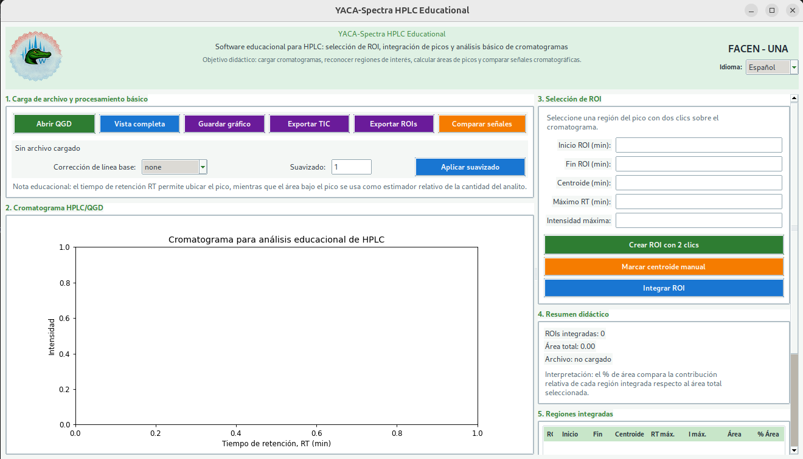
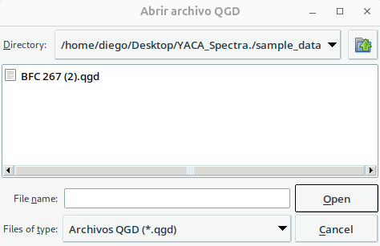
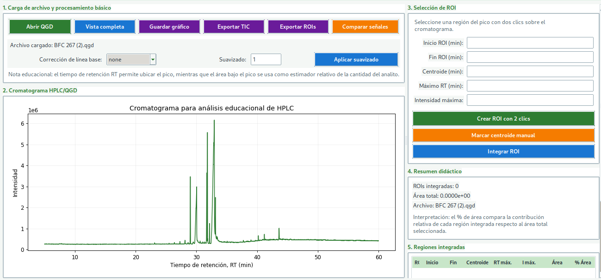
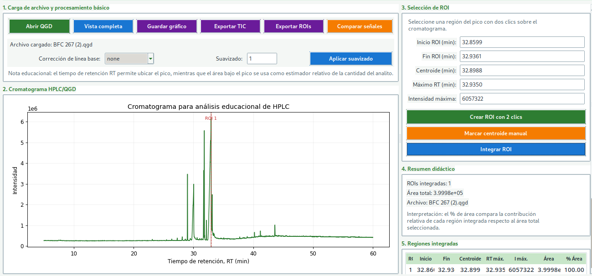
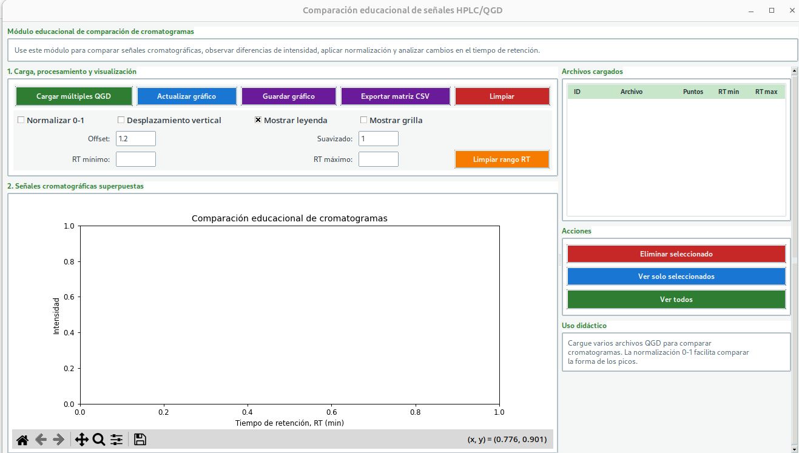
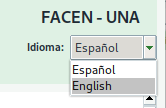

<div align="center">


# Manual de Usuario

## YACA-Spectra HPLC Educational

Software educativo para visualización, selección de ROI, integración de picos y comparación de señales cromatográficas HPLC/QGD.

[English version](USER_MANUAL.md)

</div>

---

## 1. Introducción

**YACA-Spectra HPLC Educational** es una aplicación de escritorio desarrollada en Python para apoyar actividades educativas relacionadas con el análisis de cromatogramas HPLC/QGD.

El programa permite cargar archivos cromatográficos `.qgd`, visualizar señales cromatográficas, seleccionar regiones de interés, integrar picos, calcular centroide, RT máximo, intensidad máxima, área y porcentaje de área. También permite comparar múltiples señales cromatográficas en una ventana dedicada.

---

## 2. Requisitos del sistema

Para ejecutar el programa se necesita:

* Python 3.12 o superior.
* Sistema operativo Windows, Linux o macOS.
* Interfaz gráfica disponible.
* Dependencias instaladas desde `requirements.txt`.

Las principales bibliotecas utilizadas son:

```text
numpy
pandas
matplotlib
pillow
olefile
```

En Linux, si aparece un error relacionado con Tkinter, instalar:

```bash
sudo apt install python3-tk
```

---

## 3. Instalación

### 3.1 Crear entorno virtual

```bash
python -m venv .venv
```

### 3.2 Activar entorno virtual

En Windows PowerShell:

```powershell
.\.venv\Scripts\Activate.ps1
```

En Linux/macOS:

```bash
source .venv/bin/activate
```

### 3.3 Instalar dependencias

```bash
python -m pip install --upgrade pip
pip install -r requirements.txt
```

---

## 4. Ejecución del programa

Ejecutar el programa con:

```bash
python yaca_spectra.py
```

Al iniciar, se abrirá la ventana principal de YACA-Spectra HPLC Educational.



---

## 5. Descripción de la interfaz principal

La interfaz principal está dividida en cinco regiones principales:

1. **Carga de archivo y procesamiento básico**
   Permite abrir archivos `.qgd`, aplicar suavizado, corregir línea base, exportar datos y abrir la ventana de comparación.

2. **Cromatograma HPLC/QGD**
   Muestra la señal cromatográfica como intensidad en función del tiempo de retención.

3. **Selección de ROI**
   Permite definir una región de interés para integrar un pico cromatográfico.

4. **Resumen didáctico**
   Muestra el número de ROIs integradas, el área total y el archivo cargado.

5. **Regiones integradas**
   Presenta una tabla con los resultados de cada ROI integrada.

---

## 6. Cargar un archivo QGD

Para cargar un archivo cromatográfico:

1. Hacer clic en **Abrir QGD**.
2. Seleccionar un archivo con extensión `.qgd`.
3. Confirmar la selección.



Después de cargar el archivo, el cromatograma aparecerá en la región gráfica.



---

## 7. Visualización del cromatograma

El gráfico muestra:

* Eje X: tiempo de retención, RT, en minutos.
* Eje Y: intensidad de la señal.
* Picos cromatográficos asociados a señales detectadas en diferentes tiempos de retención.

El usuario puede usar la barra de herramientas de Matplotlib para:

* Ampliar una región.
* Mover la vista.
* Volver a la vista inicial.
* Guardar una imagen del gráfico.

---

## 8. Aplicar suavizado

El campo **Suavizado** permite aplicar una media móvil simple a la señal cromatográfica.

Pasos:

1. Escribir un valor en el campo **Suavizado**.
2. Hacer clic en **Aplicar suavizado**.

Valores pequeños conservan mejor la forma original del pico. Valores muy altos pueden deformar la señal o reducir la resolución entre picos cercanos.

---

## 9. Corrección de línea base

El programa permite seleccionar el modo de corrección de línea base:

* **none**: no aplica corrección de línea base.
* **linear**: resta una línea base lineal entre el inicio y el final de la ROI.

La corrección lineal puede modificar el área calculada del pico, especialmente cuando la señal presenta inclinación o deriva de línea base.

---

## 10. Selección de una ROI

Una ROI, o región de interés, es un intervalo del cromatograma seleccionado para analizar un pico.

Para crear una ROI:

1. Hacer clic en **Crear ROI con 2 clics**.
2. Hacer el primer clic antes del pico.
3. Hacer el segundo clic después del pico.


Después de seleccionar la región, el programa completa automáticamente:

* Inicio ROI.
* Fin ROI.
* Centroide.
* Máximo RT.
* Intensidad máxima.

---

## 11. Integración de una ROI

Para integrar una ROI:

1. Seleccionar una región de interés.
2. Hacer clic en **Integrar ROI**.

El resultado aparecerá en la tabla **Regiones integradas**.



La tabla muestra:

| Columna   | Significado                                                       |
| --------- | ----------------------------------------------------------------- |
| ROI       | Número de región integrada                                        |
| Inicio    | Tiempo inicial de la ROI                                          |
| Fin       | Tiempo final de la ROI                                            |
| Centroide | Centro ponderado del pico                                         |
| RT máx.   | Tiempo de retención del máximo del pico                           |
| I máx.    | Intensidad máxima del pico                                        |
| Área      | Área integrada del pico                                           |
| % Área    | Contribución relativa de esa ROI respecto al área total integrada |

---

## 12. Centroide manual

El botón **Marcar centroide manual** permite hacer clic sobre el cromatograma para registrar visualmente una posición de centroide.

Esta función es útil con fines didácticos, ya que permite comparar una estimación visual del centro del pico con el centroide calculado automáticamente por el programa.

---

## 13. Eliminar una ROI

Para eliminar una ROI:

1. Seleccionar una fila en la tabla **Regiones integradas**.
2. Hacer clic en **Eliminar ROI seleccionada**.

El programa actualizará la tabla y recalculará los porcentajes de área.

---

## 14. Exportar cromatograma

Para exportar los datos del cromatograma:

1. Hacer clic en **Exportar TIC**.
2. Elegir el nombre y ubicación del archivo.
3. Guardar en formato `.csv`.

El archivo exportado contiene los datos del cromatograma activo.

---

## 15. Exportar tabla de ROIs

Para exportar los resultados de integración:

1. Integrar al menos una ROI.
2. Hacer clic en **Exportar ROIs**.
3. Guardar el archivo `.csv`.

El archivo contiene información como:

* Región.
* Inicio y fin de ROI.
* Centroide.
* RT máximo.
* Intensidad máxima.
* Área.
* Porcentaje de área.
* Modo de línea base.

---

## 16. Guardar gráfico

Para guardar la imagen del cromatograma:

1. Hacer clic en **Guardar gráfico**.
2. Seleccionar formato `.png` o `.pdf`.
3. Guardar el archivo.

---

## 17. Comparación de señales cromatográficas

El botón **Comparar señales** abre una ventana secundaria para comparar múltiples archivos `.qgd`.



En esta ventana se puede:

* Cargar múltiples archivos QGD.
* Superponer señales cromatográficas.
* Normalizar señales entre 0 y 1.
* Aplicar desplazamiento vertical.
* Mostrar u ocultar leyenda.
* Mostrar u ocultar grilla.
* Definir un rango de RT mínimo y máximo.
* Exportar una matriz CSV con las señales comparadas.

---

## 18. Selector de idioma

La interfaz permite seleccionar entre español e inglés desde el selector de idioma ubicado en el encabezado de la aplicación.



Al cambiar el idioma, la interfaz se reconstruye y los textos visibles se actualizan.

---

## 19. Flujo de trabajo recomendado

Un flujo de trabajo básico sería:

```text
Abrir QGD → Visualizar cromatograma → Seleccionar ROI → Integrar ROI → Exportar resultados
```

Para comparación de señales:

```text
Comparar señales → Cargar múltiples QGD → Normalizar 0-1 → Analizar diferencias → Exportar matriz CSV
```

---

## 20. Interpretación educativa de los resultados

El programa fue diseñado para facilitar la enseñanza de conceptos como:

* Tiempo de retención.
* Intensidad de señal.
* Forma del pico.
* Área bajo el pico.
* Centroide.
* Máximo del pico.
* Corrección de línea base.
* Suavizado.
* Comparación entre cromatogramas.

El área integrada puede utilizarse como un estimador relativo de la cantidad de analito, siempre considerando las condiciones experimentales, el método cromatográfico y el tratamiento aplicado a la señal.

---

## 21. Problemas comunes

### El programa no abre

Verificar que el entorno virtual esté activado y que las dependencias estén instaladas:

```bash
pip install -r requirements.txt
```

### Error relacionado con Tkinter en Linux

Instalar soporte Tk:

```bash
sudo apt install python3-tk
```

### No aparece el logo

Verificar que el archivo exista en:

```text
assets/logo_yacaspectra2.png
```

### No se puede abrir un archivo

Verificar que el archivo tenga extensión `.qgd` y que no esté dañado.

### La ROI no se integra

Verificar que la ROI tenga al menos dos puntos dentro del intervalo seleccionado.

---

## 22. Notas sobre los datos

Los archivos `.qgd` pueden contener datos experimentales. Si contienen información privada, institucional o no publicada, no deben subirse a repositorios públicos.

Para compartir ejemplos, se recomienda incluir solamente archivos autorizados en la carpeta:

```text
sample_data/
```

---

## 23. Licencia

Este proyecto se distribuye bajo la licencia MIT. Consulte el archivo `LICENSE` para más información.

---

<div align="center">

**YACA-Spectra HPLC Educational**
Manual de usuario en español.

</div>
